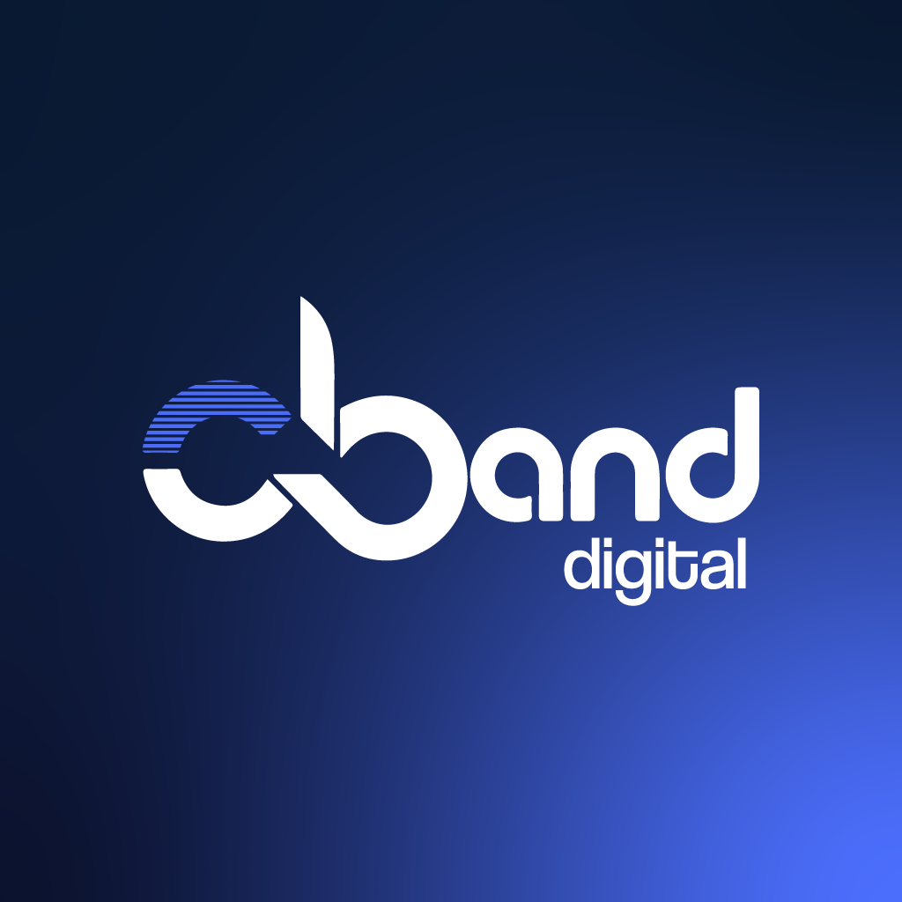

<!-- Logo -->

  

<h1 align="center">Caner Duzenli</h1>
<h3 align="center">Software Developer | Founder at C-Band Digital Innovations</h3>

---

## About Me  

I am a dedicated **Software Developer** and the **Founder of C-Band Digital Innovations**, a technology company focused on building secure, scalable, and innovative digital platforms.  

With expertise in **JavaScript, React, Next.js, C#, Python, .NET, MVC, MySQL, and HTML/CSS**, I bring a strong foundation in **object-oriented programming** and practical engineering insight to every project.  

My professional journey combines **engineering experience** with **software development expertise**, enabling me to design solutions that are both technically sound and aligned with business needs.  

At **C-Band Digital Innovations**, my focus is on creating digital systems that improve efficiency, reliability, and connectivity—bridging technology with real-world applications to deliver measurable value.  

---

## Contact  

  <strong style="font-size:18px;">CANER DUZENLI</strong> 
  Software Developer | Founder at C-Band Digital Innovations

  

  
  

  “Delivering Trust Through Digital Innovation”

---

## Vision & Mission  

- **Vision:** To become a trusted leader in digital innovation, delivering solutions that empower businesses and individuals to thrive in a connected world.  
- **Mission:** To design and develop secure, scalable, and intelligent platforms that bridge technology with practical applications, ensuring reliability, efficiency, and measurable impact.  

---

## Highlighted Projects  

### 🔹 [C-Band Digital Website](https://www.cbanddigital.com)  
A professional tech solutions website showcasing services in software development, IT solutions, and digital platforms.  

### 🔹 [GitHub Project: Automation Tool](https://github.com/canerduzenli)  
An experimental automation system designed to integrate APIs and streamline workflows for small businesses.  

### 🔹 [React / Next.js Components](https://github.com/canerduzenli)  
Reusable UI components built with **React** and **Next.js**, focusing on scalability and performance.  

---

## Core Skills  

  

---

## GitHub Statistics  

  

